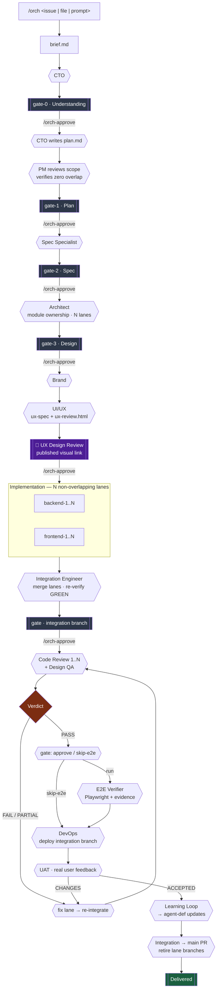

# Agent Delivery Harness

A file-based, gate-driven system for running multi-agent software delivery in Claude Code. A roster of role agents — spec, architecture, **brand, UI/UX**, backend, frontend, QA, DevOps, **UAT**, plus a PM and an orchestrator — takes a task from a GitHub issue or a plain prompt through to deployed, user-accepted code, with a human approval gate between every phase. For user-facing work the design phase includes a **visual UX Design Review** the product owner signs off on before any code is written, and delivery closes with a post-deploy **UAT** stage that feeds a **learning loop** back into the agent definitions.

The point is not that agents write code. It's that the work is **scoped, structured, and verified** — each agent gets a bounded assignment, hands off through a defined schema rather than conversation, and nothing advances until a gate is approved.

---

## How it works



**Three properties worth calling out:**

**Gates are blocking.** Every phase ends with a gate file the user must approve. Deployment is declared dependent on a QA PASS in `plan.md`, and that dependency is enforced — an agent cannot advance past a failing gate.

**Parallel work is made safe by ownership, not coordination.** The Architect assigns explicit module ownership in `design.md`. The PM verifies zero scope overlap before marking any mailbox `pm-approved: true`. Agents are forbidden from editing files another instance owns, work on separate branches, and write to separate sub-gates (`gate-4a`, `gate-4b`) so their outputs cannot collide.

**Handoffs are schema'd, not conversational.** Every artifact — brief, plan, spec, design, mailbox, gate — has a defined schema in [`protocol.md`](./protocol.md). A malformed handoff fails at a boundary instead of silently corrupting everything downstream.

---

## Requirements

- **[Claude Code](https://claude.com/claude-code)** — this harness is Claude Code-native. It relies on subagent invocation and on `~/.claude/` discovery for agents and slash commands. It will not run as-is in other tools.
- **`git`**, and **`gh`** (GitHub CLI) if you want the DevOps role to raise PRs.
- macOS or Linux.

---

## Install

```bash
git clone https://github.com/richrhyms/agent-delivery-harness.git
cd agent-delivery-harness
./install.sh
```

`install.sh` symlinks the agent and command definitions into `~/.claude/` (symlinks, so `git pull` picks up updates), copies the protocol spec and config, and creates the runtime directories:

```
~/.claude/agents/orchestration/   ← 8 role agents      (symlinked)
~/.claude/commands/orch*.md       ← 6 slash commands   (symlinked)
~/.claude/orchestration/
├── protocol.md                   ← artifact schemas   (copied)
├── config.md                     ← agent roster       (copied)
├── projects/                     ← your project configs
├── active/                       ← in-progress tasks
└── archive/                      ← completed tasks
```

Runtime state (`projects/`, `active/`, `archive/`) stays out of the repo — it's your data, not shipped code.

> **Note:** the agent definitions reference `~/.claude/orchestration/` by absolute path, so the install location is fixed. See [Known gaps](#known-gaps).

---

## Quickstart

### 1. Configure a project (once per codebase)

```
/orch-setup my-project
```

Walks you through creating `~/.claude/orchestration/projects/my-project.md` — tech stack, repos, cloud and auth approach, health-check command, conventions. This is what lets the same role agents work across different codebases.

### 2. Start a task

```
/orch https://github.com/owner/repo/issues/42
/orch ./docs/some-spec.md
/orch "add rate limiting to the payments API"
```

Any of these normalize into a `brief.md` and hand off to the CTO, which writes **gate-0** — its understanding of what you actually asked for, before any work happens.

### 3. Approve through the gates

```
/orch-approve                      # advance
/orch-approve reject <feedback>    # send it back with corrections
```

After each approval the next phase runs and writes its own gate. You review, approve, repeat.

### 4. Check in or pick back up

```
/orch-status      # where is this task?
/orch-resume      # resume a task from wherever it stopped
```

### What to expect

The [worked example](#worked-example) — a 7-screen Next.js app with auth, a state machine, and live LLM calls — went from approved plan to deployed in **under a day**, and most of the elapsed time was waiting on gate approvals, not agent work.

---

## Commands

| Command | Purpose |
|---|---|
| `/orch <input>` | Start a task. Accepts a GitHub issue URL, `owner/repo#N`, a filepath, or a plain prompt. |
| `/orch-plan <input>` | Plan-only mode — produces the plan and stops. No implementation. |
| `/orch-approve` | Approve the current gate and advance. `reject <feedback>` sends it back. |
| `/orch-status` | Show current gate, active agents, and last action for a task. |
| `/orch-resume` | Resume an in-progress task from its last state. |
| `/orch-setup [project]` | Create or update a project config. |

---

## Roles

| Role | Owns | Max parallel |
|---|---|---|
| **CTO** | Orchestration, gate sequencing, mailbox assignment, `state.md` | 1 |
| **PM** | Reviews plans and scope assignments; verifies zero overlap before work starts | 1 |
| **Spec Specialist** | `spec.md` — requirements, acceptance criteria, **user flows & states** | 1 |
| **Architect** | `design.md` — API contracts, data models, **module ownership** | 1 |
| **Brand Agent** | `brand.md` — brand identity as a single **configurable** source | 1 |
| **UI/UX Engineer** | `ux-spec.md` + visual **`ux-review.html`**; design system; Design QA pass | 1 |
| **Backend Engineer** | Server-side implementation within assigned scope | **N** |
| **Frontend Engineer** | UI implementation within assigned scope | **N** |
| **Integration Engineer** | Merges done lanes → one integration branch, resolves conflicts, re-verifies green; promotes to `main` post-UAT | 1 |
| **Code Reviewer** (static QA) | Reviews the integration branch vs spec/design + build/lint/unit green; PASS / PARTIAL / FAIL | **N** |
| **E2E Verifier** (execution QA) | Drives real user journeys in a browser (Playwright) with captured evidence; optional/gated | 1 |
| **DevOps Engineer** | Deployment and health verification (deploys the integration branch) | 1 |
| **UAT Engineer** | Post-deploy: triages user feedback, coordinates fixes via the Architect, runs the learning loop | 1 |

Backend/Frontend are no longer capped at 2 — the CTO sizes N to the independent scope lanes in
`design.md`; the PM verifies zero overlap across all N.

### Design review & UAT (user-facing deliveries)

- **Design phase:** after the Architect, the **Brand** and **UI/UX** agents run before any code. The
  UI/UX agent produces a self-contained **`ux-review.html`** — a visual map of the end-to-end user
  journey(s), key screens/states, and design system.
- **UX Design Review (human gate):** the CTO **publishes `ux-review.html` to a shareable link** (via the
  Artifact tool) and the product owner approves the proposed journey/design **before implementation
  starts**. Rejections loop back to the UI/UX agent to revise and re-publish.
- **UAT (post-deploy):** once deployed, the CTO collects the user's real feedback; the UAT Engineer
  triages it (defect / change / preference / reusable insight), coordinates any fixes **through the
  Architect** (it never implements), and produces a verdict. Changes trigger a fix → re-deploy → re-UAT
  loop.
- **Learning loop:** after UAT acceptance, genuine reusable insights (not personal preferences) become
  **user-approved edits to the relevant agent definitions**, so the harness improves with every delivery.

Every role definition carries an explicit **NEVER DO** block — never work outside your mailbox scope, never start without `pm-approved: true`, never push or merge, never skip your gate file, never modify files another instance owns. In practice the negative constraints did more to make behaviour predictable than the positive instructions.

---

## Artifacts

Full schemas in [`protocol.md`](./protocol.md).

| File | Written by | Purpose |
|---|---|---|
| `brief.md` | `/orch` | Normalized input |
| `plan.md` | CTO, signed by PM | Gate sequence, agents involved, dependencies |
| `spec.md` | Spec Specialist | Requirements and acceptance criteria |
| `design.md` | Architect | API contracts, data models, module ownership |
| `brand.md` | Brand Agent | Brand identity + the single configurable source of truth |
| `ux-spec.md` | UI/UX Engineer | Design system + per-screen specs (all four states) |
| `ux-review.html` | UI/UX Engineer | **Visual** end-to-end journey/design page — published to a link for human review |
| `integration/<task-id>` (branch) | Integration Engineer | Done lanes merged + re-verified green; what QA/DevOps/UAT run on |
| `code-review-report(-N).md` | Code Reviewer | Static review + typecheck/lint/unit results |
| `e2e-report.md` | E2E Verifier | Browser journey results + evidence (screenshots/traces) |
| `uat-report.md` | UAT Engineer | Feedback triage + verdict (ACCEPTED / CHANGES-REQUESTED) |
| `learning-proposals.md` | UAT Engineer | Reusable insights → proposed agent-definition edits |
| `state.md` | CTO | Navigation index — *derived, never the source of truth* |
| `gates/gate-N.md` | Phase owner | What was done, deliverable, criteria met, approval status |
| `agents/<role>/mailbox.md` | CTO / PM | Scoped assignment for one agent |

`state.md` exists purely as a context optimisation: rather than re-reading every gate file on each invocation, the CTO reads one index to know where it is. Gate files remain authoritative.

---

## Worked example

[`examples/unicorn-factory/`](./examples/unicorn-factory/) is a complete, unedited trace of a real run — brief, plan, spec, architecture, six mailboxes, and all ten gate files.

**What it produced:** a 7-screen Next.js 14 app with Supabase auth, a project state machine, and live LLM calls, deployed to production.

**Why it's the interesting part — QA blocked the deploy:**

| Gate | Verdict |
|---|---|
| `gate-6` — QA | **PARTIAL** — 27 pass, 1 fail, 2 skip |
| `gate-7-fix` — Backend | One-line fix: `.gitignore` had `.env*`, which silently swallowed `.env.example` |
| `gate-7-reqa` — QA re-run | **PASS** — 28 pass, 0 fail, 2 skip |
| `gate-8` — DevOps | Deployed |

The plan declared deployment dependent on a QA PASS, and the gate held. The defect was real: anyone cloning the repo would have had no setup template, and the README's instructions would have referenced a file that wasn't there.

**The two SKIPs matter as much as the fail.** QA marked `tsc --noEmit` and `npm run build` as SKIP *with a stated reason* — "requires a running environment" — rather than claiming a pass it couldn't prove. An agent that reports what it could not verify is worth considerably more than one that asserts success it never established.

---

## Known gaps

Stated plainly, because knowing where a system is weak is more useful than pretending it isn't.

- **QA now has an execution path (E2E Verifier), gated on a runnable environment.** QA is split into a
  **Code Reviewer** (static: reads code vs spec/design, runs typecheck/lint/unit) and an **E2E Verifier**
  (execution: stands up the integration branch and drives real user journeys in a browser with Playwright,
  capturing screenshots/traces). This closes the old "static review only" gap in principle — but the E2E
  pass is only as good as the environment the project provides: a runnable instance + seeded test data +
  test accounts + test-mode/mocked external services (LLMs, payments). Where that environment can't be
  stood up, the E2E Verifier reports BLOCKED and the affected criteria fall back to UNTESTABLE rather than
  a fabricated pass. E2E is also operator-skippable at the static→E2E gate (a recorded decision).
- **No secret scanning.** Verification checks correctness, not credential hygiene.
- **Install path is fixed.** Agent definitions reference `~/.claude/orchestration/` by absolute path rather than resolving it from config.
- **Claude Code only.** The harness depends on Claude Code's subagent and command discovery model.
- **DevOps stops at the boundary.** Where deployment needs interactive shell access or tokens, the DevOps role emits a step-by-step runbook for a human rather than executing it.

---

## Repo layout

```
agents/         13 role definitions
commands/       6 slash commands
protocol.md     artifact schemas
config.md       agent roster, gate labels, runtime paths
examples/       complete trace of a real run
install.sh
```

---

## License

MIT
